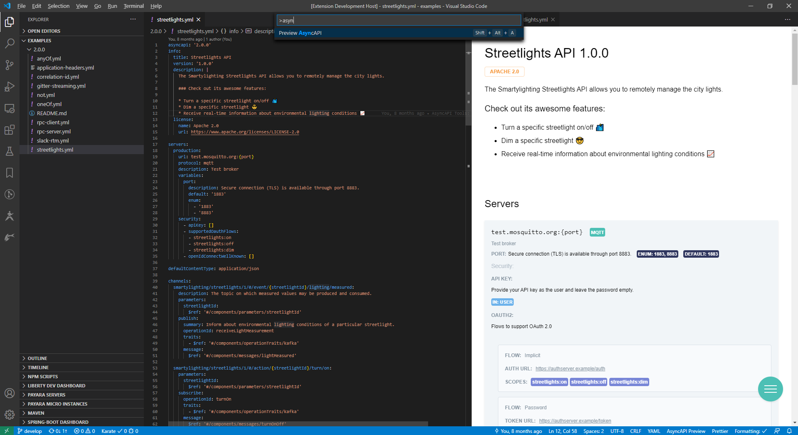
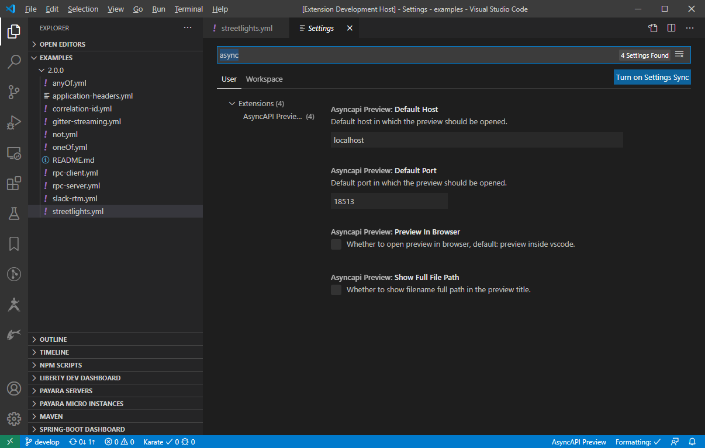
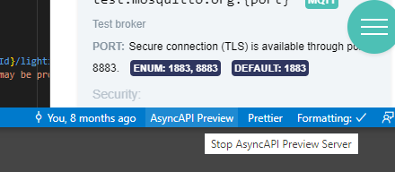

 

# AsyncAPI Playground Viewer - v0.0.1

**AsyncAPI Playground Viewer lets you preview AsyncAPI 2.0.0 files as you type in Visual Studio Code. Additionally provide intellisense/linting for the files as well.**

It works on asyncapi files in yaml format. Preview happens in real time as you type.

## Requirements
AsyncAPI Playground Viewer uses https://github.com/asyncapi/generator which requires this software to be installed:

- v12.16+ < Node.js
- v6.13.7+ < npm

## Preview

To start

- Open the asyncapi file and press F1.
- Run the Command `Preview AsyncAPI`.

OR

- Press `Shift + Alt + A`

OR

- Click in the Editor's title bar and click `Preview AsyncAPI`

OR

- Right click file in explorer panel and click `Preview AsyncAPI`

THEN

- Preview it in vscode Itself like this

## Configurations

### Opening In External browser

If you want to preview the changes in external browser change the settings `Preview In Browser` to `true` in `User/Workspace Settings`

THEN

- Run the Command `Preview AsyncAPI`.

OR

- Press `Shift + Alt + A`

**Preview will be automatically opened in default browser.**

### Change Default Port

Default port of the preview url can be changed by changing the `Default Port` value in `User/Workspace Settings`

### Show Only File Name

In the preview title the file name along with the full path is displayed by default. It can be changed to show only the file name by changing the `Show Only File Name` to `true` in `User/Workspace Settings`

### Change Default Host

Default host(localhost) of the preview url can be changed by changing the `asyncapiViewer.defaultHost` value in `User/Workspace Settings`

### Stop AsyncAPI Preview Server

To stop the preview server simply click the status bar item.

## Releases

### Credits

AsyncAPI Viewer utilizes the following open source projects

- [AsyncAPI Generator](https://github.com/asyncapi/generator)
- [Express](https://github.com/expressjs/express)
- [socket.io](https://github.com/socketio/socket.io/)
- [yaml.js](https://github.com/jeremyfa/yaml.js)

### Contributors

This extension is inspired in [Swagger Viewer](https://github.com/arjun-g/vs-swagger-viewer)
