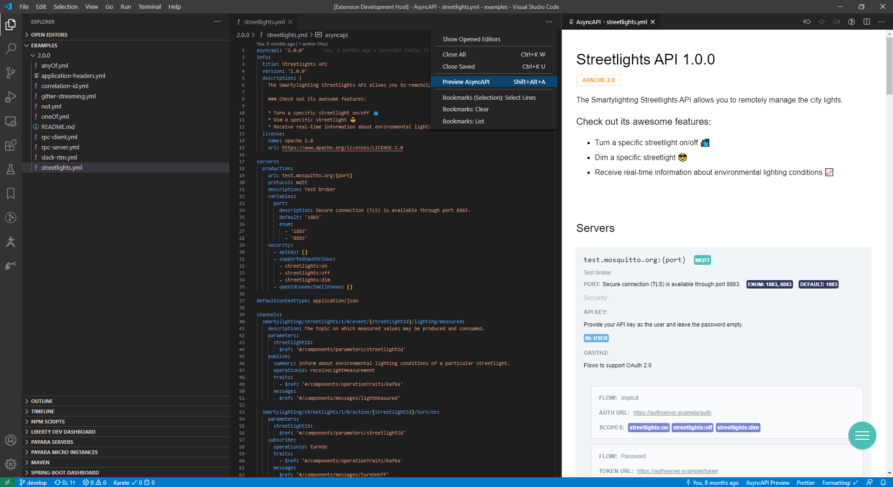

 

# AsyncAPI Preview

Preview AsyncAPI documents inside VSCode.

AsyncAPI Preview was simplified and reworked from scratch to use the latest [@asyncapi/asyncapi-react](https://github.com/asyncapi/asyncapi-react/tree/next), removing old dependencies on Express, socket.io and js-yaml with better startup performance and bundle size.

You can open AsyncAPI Preview from the editor title/context menu. (If you don't see that button, you can use `shift+command+P` to open command palette and select `Preview AsyncAPI`.)

## Automatic hot-reloading

Automatic hot-reloading on editor save, but currently, it doesn't reload when saving referenced external files.

## Content Assistance

### Available snippets:

Open an empty or otherwise yaml file and start typing one of the following prefixes, you may need to press `Ctrl+space` to trigger autocompletion in some cases:

- `add asyncapi skeleton`: Adds an asyncapi skeleton for jump starting your API editing.
- `add asyncapi subscribe to async request`: Inserts a new subscribe operation, for listening to incoming async requests/commands.
- `add asyncapi publish event operation`: Inserts a new publish operation, for producing domain events.
- `add asyncapi message`: Inserts a new message, you can choose it to be either a **Request** or an **Event**.

Once snippets are inserted use the `<TAB>` key to travel between snippet placeholders.

## Paste as Schema

You can also autogenerate an Schema object from a JSON example.

Right-click inside `#/components/schemas` section and choose `AsyncAPI: Paste as Schema` from the context menu.

### Credits

AsyncAPI Viewer utilizes the following open source projects:

- [@asyncapi/asyncapi-react](https://github.com/asyncapi/asyncapi-react/tree/next)

### Contributors

Ivan Garcia Sainz-Aja [ivangsa](https://github.com/ivangsa)
